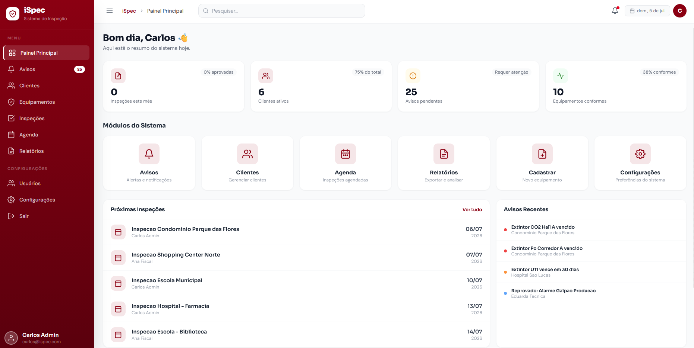
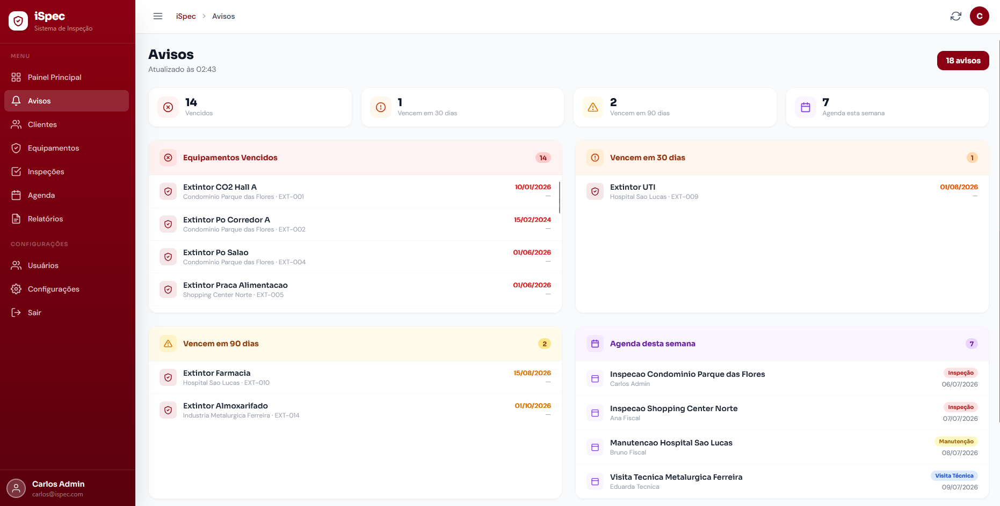
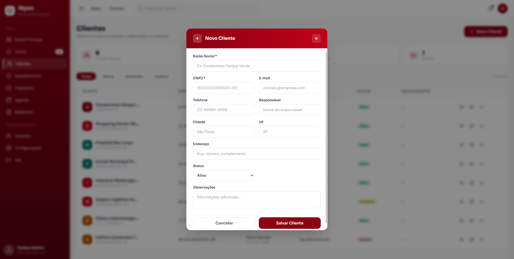
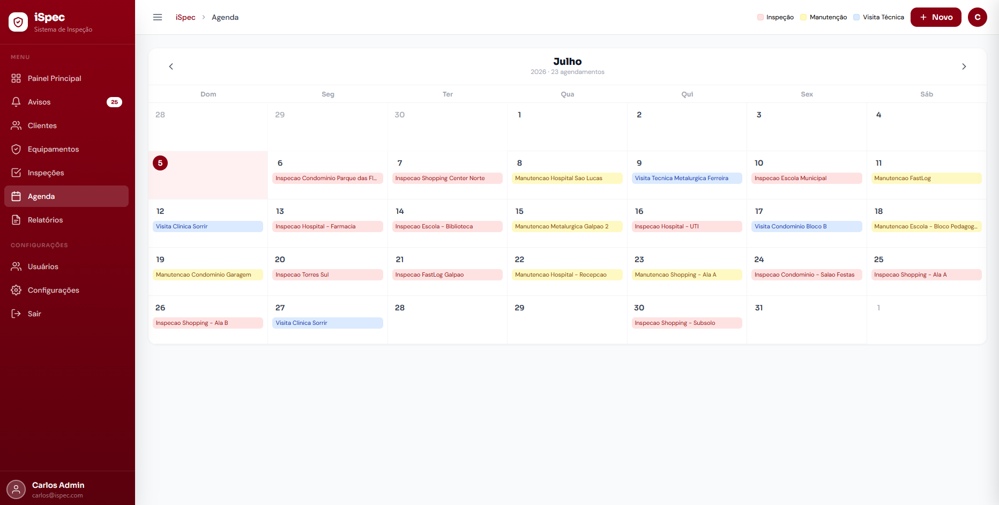
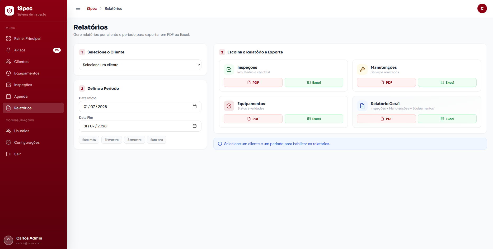

# iSpec – Sistema de Inspeção de Equipamentos de Incêndio

Aplicação web full-stack para gestão e inspeção de equipamentos de combate a incêndio (extintores, alarmes e hidrantes), desenvolvida como Trabalho de Conclusão de Curso (TCC).

O sistema permite o cadastro de equipamentos, o registro de inspeções técnicas e a geração de relatórios, com controle de acesso baseado em perfis de usuário (Administrador, Fiscal e Técnico).

---

## 📸 Capturas de tela

### Painel Principal


### Avisos e Alertas


### Cadastro de Clientes


### Agenda de Inspeções


### Geração de Relatórios


---

## ✨ Funcionalidades

- Painel principal com resumo de inspeções, equipamentos e avisos do dia
- Cadastro e gestão de equipamentos de incêndio (extintores, alarmes, hidrantes)
- Sistema de avisos automáticos para equipamentos vencidos ou próximos do vencimento
- Registro e acompanhamento de inspeções técnicas
- Agenda visual com tipos de evento por cor (Inspeção, Manutenção, Visita Técnica)
- Autenticação e autorização via JWT, com controle de acesso por perfil (Administrador, Fiscal, Técnico)
- Login social com Google (OAuth2)
- Geração de relatórios em PDF e Excel (Inspeções, Manutenções, Equipamentos e Relatório Geral)
- API REST consumida também por um aplicativo Android complementar

## 🛠️ Tecnologias

**Backend**
- Java 21
- Spring Boot
- Spring Security (JWT + OAuth2)
- MySQL
- iText (geração de PDF)
- Apache POI (geração de Excel)

**Frontend**
- HTML5, CSS3 e JavaScript
- Tailwind CSS

**Mobile**
- Aplicativo Android nativo consumindo a API via Retrofit

## 🏗️ Arquitetura

- API REST organizada em camadas (controller, service, repository)
- Herança de equipamentos (`Extintor`, `Alarme`, `Hidrante`) com `InheritanceType.JOINED`
- DTOs dedicados para serialização/deserialização segura de subtipos
- Controle de acesso por perfil com regras específicas por endpoint

## 🚀 Como executar o projeto

### Pré-requisitos
- Java 21+
- Maven
- MySQL

### Passos

```bash
# Clone o repositório
git clone https://github.com/Milton-Pires/ISpec-WEB.git
cd ISpec-WEB

# Configure as credenciais do banco de dados em
# src/main/resources/application.properties

# Execute o projeto
./mvnw spring-boot:run
```

A aplicação estará disponível em `http://localhost:8080`.

## 📌 Status do projeto

Em desenvolvimento — projeto de TCC em andamento.

## 👤 Autor

**Milton Pires Nunes Neto**  
[GitHub](https://github.com/Milton-Pires)